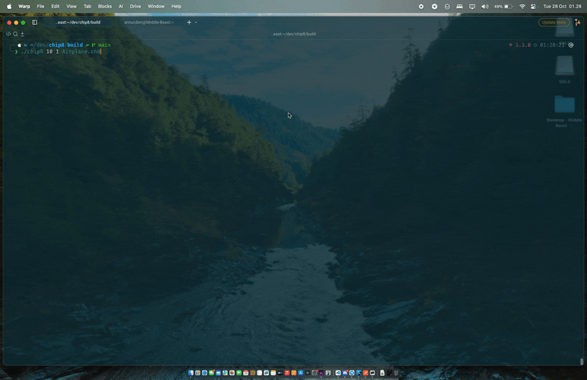

## Chip 8 Emulator


simple project to learn about emulator design, nice exercie to know more about how cpu works

### Build

```
mkdir build && cd build
cmake ..
make
```
### Run

```
./chip8 <scale> <delay> ROM.ch8

./chip8 10 1 ROM.ch8
```
